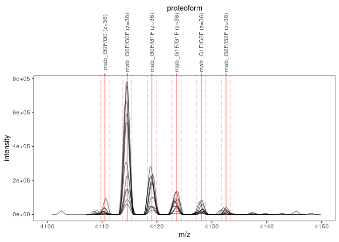
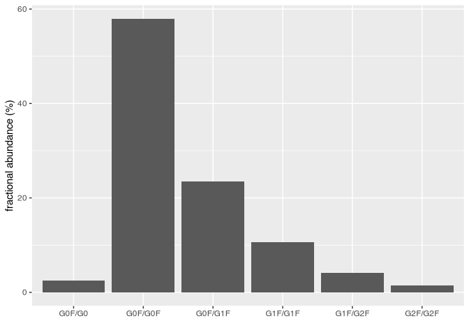

# fragquaxi 

## Overview

`fragquaxi` allows you to obtain **fr**actional **a**bundances of
**g**lycoforms (and proteoforms in general) from mass spectrometric (MS)
data by **qua**ntification *via* **X**IC (extracted ion current)
**i**ntegration.

## Installation

`fragquaxi` is currently only available from GitHub.

``` r
remotes::install_github("cdl-biosimilars/fragquaxi")
```

## Usage

Load mass spectrometric data.

``` r
library(fragquaxi)
library(tibble)
library(dplyr)
library(tidyr)
library(ggplot2)

ms_data <- mzR::openMSfile(
  system.file("extdata", "mzml", "mab1.mzML", package = "fragquaxi")
)
```

Define proteins.

``` r
mab_sequence <- system.file(
  "extdata", "mab_sequence.fasta",
  package = "fragquaxi"
)

proteins <- define_proteins(
  mab = mab_sequence,
  .disulfides = 16
)
```

Define PTM compositions.

``` r
modcoms <- tribble(
  ~modcom_name, ~Hex, ~HexNAc, ~Fuc,
  "G0F/G0",        6,       8,    1,
  "G0F/G0F",       6,       8,    2,
  "G0F/G1F",       7,       8,    2,
  "G1F/G1F",       8,       8,    2,
  "G1F/G2F",       9,       8,    2,
  "G2F/G2F",      10,       8,    2,
) %>% 
  define_ptm_compositions()
```

Assemble proteoforms and calculate mass-to-charge ratios of proteoform
ions in charge states 33+ to 40+

``` r
pfm_ions <-
  assemble_proteoforms(proteins, modcoms) %>% 
  ionize(charge_states = 33L:40L)

pfm_ions
#> # A tibble: 48 x 8
#>    protein_name modcom_name formula                         mass     z    mz
#>    <chr>        <chr>       <mol>                          <dbl> <int> <dbl>
#>  1 mab          G0F/G0      C6570 H10124 N1714 O2088 S44 147942.    33 4484.
#>  2 mab          G0F/G0      C6570 H10124 N1714 O2088 S44 147942.    34 4352.
#>  3 mab          G0F/G0      C6570 H10124 N1714 O2088 S44 147942.    35 4228.
#>  4 mab          G0F/G0      C6570 H10124 N1714 O2088 S44 147942.    36 4111.
#>  5 mab          G0F/G0      C6570 H10124 N1714 O2088 S44 147942.    37 3999.
#>  6 mab          G0F/G0      C6570 H10124 N1714 O2088 S44 147942.    38 3894.
#>  7 mab          G0F/G0      C6570 H10124 N1714 O2088 S44 147942.    39 3794.
#>  8 mab          G0F/G0      C6570 H10124 N1714 O2088 S44 147942.    40 3700.
#>  9 mab          G0F/G0F     C6576 H10134 N1714 O2092 S44 148088.    33 4489.
#> 10 mab          G0F/G0F     C6576 H10134 N1714 O2092 S44 148088.    34 4357.
#> # … with 38 more rows, and 2 more variables: mz_min <dbl>, mz_max <dbl>
```

Plot these ions (here, only charge state 36+ of scans 126 to 136).

``` r
plot_ions(
  ms_data,
  ions = pfm_ions,
  scans = 126:136,
  xlim = c(4100, 4150)
)
```



Quantify these ions via XIC integration.

``` r
abundances <- quantify_ions(
  ms_data,
  pfm_ions,
  rt_limits = c(300, 350)
)

abundances
#> ℹ Abundances of 48 ions quantified in 352 mass spectra using 1 retention time window.
#> 
#> ── Parameters ──
#> 
#> MS data file:
#> '/home/wolfgang/R/x86_64-pc-linux-gnu-library/4.0/fragquaxi/extdata/mzml/mab1.mzML'
#> 
#> Ions:
#> # A tibble: 48 x 9
#>   ion_id protein_name modcom_name formula                         mass     z
#>   <chr>  <chr>        <chr>       <mol>                          <dbl> <int>
#> 1 id_1   mab          G0F/G0      C6570 H10124 N1714 O2088 S44 147942.    33
#> 2 id_2   mab          G0F/G0      C6570 H10124 N1714 O2088 S44 147942.    34
#> 3 id_3   mab          G0F/G0      C6570 H10124 N1714 O2088 S44 147942.    35
#> 4 id_4   mab          G0F/G0      C6570 H10124 N1714 O2088 S44 147942.    36
#> 5 id_5   mab          G0F/G0      C6570 H10124 N1714 O2088 S44 147942.    37
#> # … with 43 more rows, and 3 more variables: mz <dbl>, mz_min <dbl>,
#> #   mz_max <dbl>
#> 
#> Retention time limits:
#> # A tibble: 1 x 3
#>   rt_min rt_max scans     
#>    <dbl>  <dbl> <list>    
#> 1    300    350 <int [25]>
#> 
#> ── Results ──
#> 
#> # A tibble: 1 x 50
#>   rt_min rt_max    id_1    id_2   id_3   id_4   id_5   id_6   id_7   id_8   id_9
#>    <dbl>  <dbl>   <dbl>   <dbl>  <dbl>  <dbl>  <dbl>  <dbl>  <dbl>  <dbl>  <dbl>
#> 1    300    350 153744. 204512. 2.57e5 3.34e5 1.84e5 1.77e5 1.21e5 1.14e5 2.90e6
#> # … with 39 more variables: id_10 <dbl>, id_11 <dbl>, id_12 <dbl>, id_13 <dbl>,
#> #   id_14 <dbl>, …
```

Plot abundances.

``` r
abundances %>%
  as_tibble() %>% 
  unnest(abundance_data) %>% 
  group_by(modcom_name) %>%
  summarise(abundance = sum(abundance)) %>% 
  mutate(frac_ab = abundance / sum(abundance) * 100) %>% 
  ggplot(aes(modcom_name, frac_ab)) +
  geom_col() +
  xlab("") +
  ylab("fractional abundance (%)")
```


